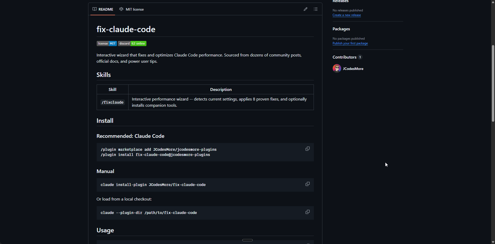

# Fix Claude Code

<a href="https://github.com/JCodesMore/fix-claude-code/blob/main/LICENSE"></a> <a href="https://discord.gg/babcVNJBet"></a>

An interactive Claude Code plugin that fixes and optimizes your Claude Code performance. Sourced from dozens of community posts, official docs, and power user tips.

Run `/fixclaude` and the wizard handles the rest -- no jargon, no guesswork.

## Demo

[](https://youtu.be/PLACEHOLDER)

> Click the image above to watch the full walkthrough on YouTube.

## Skills

| Skill | Description |
|-------|-------------|
| `/fixclaude` | Interactive performance wizard -- detects current settings, applies 8 proven fixes, and optionally installs companion tools. |

## Install

### Recommended: Claude Code

```bash
/plugin marketplace add JCodesMore/jcodesmore-plugins
/plugin install fix-claude-code@jcodesmore-plugins
```

### Manual

```bash
claude install-plugin JCodesMore/fix-claude-code
```

Or load from a local checkout:

```bash
claude --plugin-dir /path/to/fix-claude-code
```

## Usage

```
/fixclaude
```

The wizard walks you through every step:

1. **Detects current settings** and shows what's missing
2. **Applies 8 proven performance fixes** -- max effort, deep thinking, smooth rendering, agent teams, and more
3. **Optionally installs companion tools** -- Claude HUD, Context7, Playwright, Caveman, Chrome integration
4. **Shows a clear summary** of everything that changed

Every step is explained in plain language. No config files to hunt down, no values to guess.

## What Gets Fixed

### Core Performance Settings

| Setting | What it does |
|---------|-------------|
| `CLAUDE_CODE_EFFORT_LEVEL=max` | Full reasoning every turn |
| `CLAUDE_CODE_DISABLE_ADAPTIVE_THINKING=1` | Consistent deep thinking (no under-allocation) |
| `MAX_THINKING_TOKENS=31999` | Maximum reasoning budget |
| `CLAUDE_CODE_DISABLE_1M_CONTEXT=1` | More compute for thinking |
| `alwaysThinkingEnabled=true` | Extended thinking every turn |
| `CLAUDE_CODE_NO_FLICKER=1` | Smooth screen rendering |
| `CLAUDE_CODE_DISABLE_NONESSENTIAL_TRAFFIC=1` | Disable telemetry and background network |
| `CLAUDE_CODE_EXPERIMENTAL_AGENT_TEAMS=1` | Multi-agent coordination |

### Optional Plugins

| Plugin | What it does |
|--------|-------------|
| Claude HUD | Status dashboard -- context %, tokens, rate limits |
| Context7 MCP | Live, up-to-date library documentation |
| Playwright MCP | Browser-based self-testing |
| Caveman | Shorter, more focused output |
| Claude in Chrome | Control your browser from the terminal |

## How It Works

The plugin is a single interactive skill with no code dependencies. It reads your current `~/.claude/settings.json`, shows you what's missing, and merges in the recommended values -- preserving everything else in your config.

Optional plugins are presented one at a time so you can pick what you want. MCP servers (Context7, Playwright) are installed automatically. Plugins that require interactive commands (Claude HUD, Caveman) give you the exact command to paste.

## Credits

Built from tips by [@hqmank](https://x.com/hqmank), [@bcherny](https://x.com/bcherny) (Claude Code creator), [@ykdojo](https://github.com/ykdojo/claude-code-tips), [@adocomplete](https://x.com/adocomplete) (Anthropic DevRel), and many others in the Claude Code community.

## License

[MIT](LICENSE)
